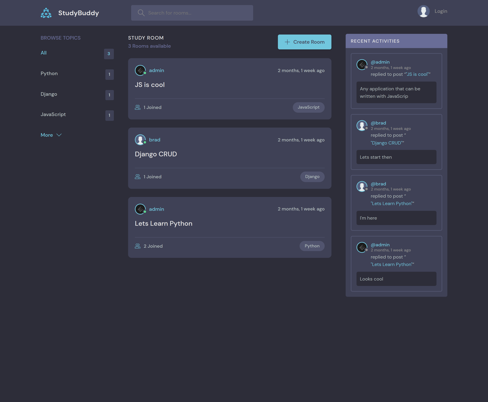
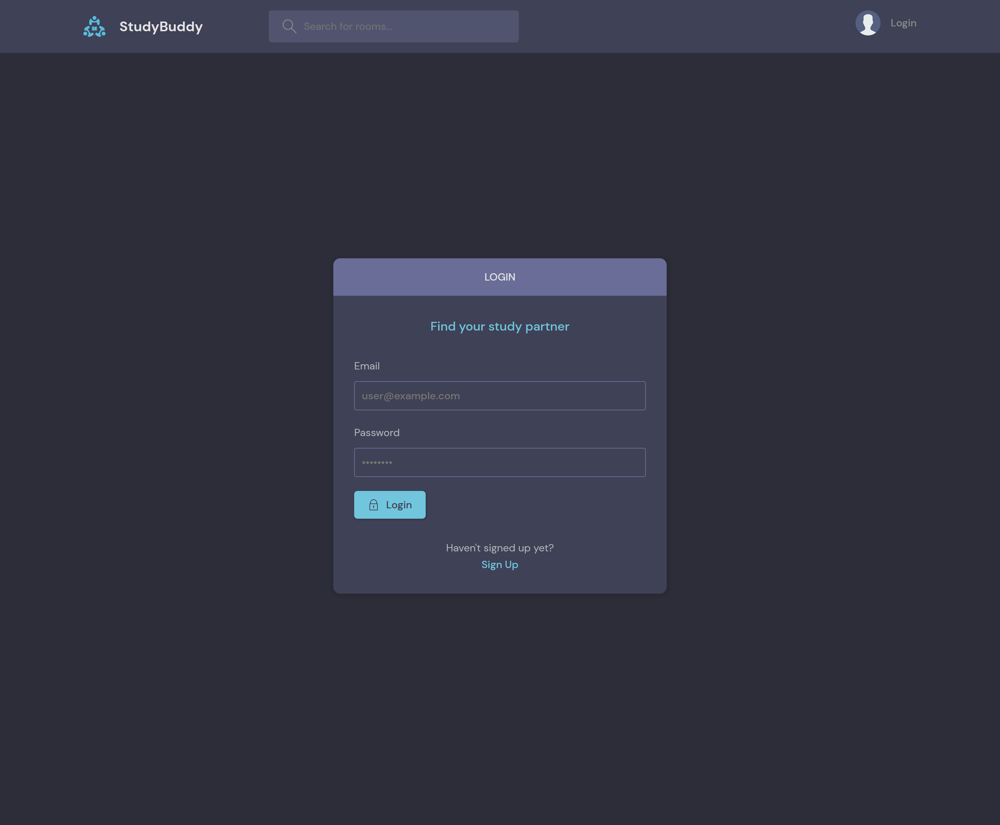
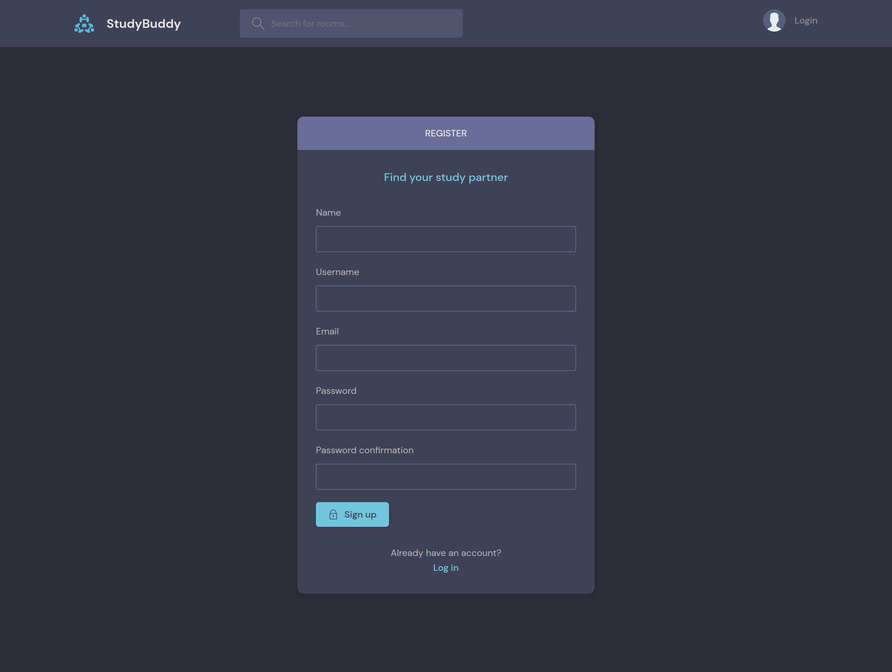
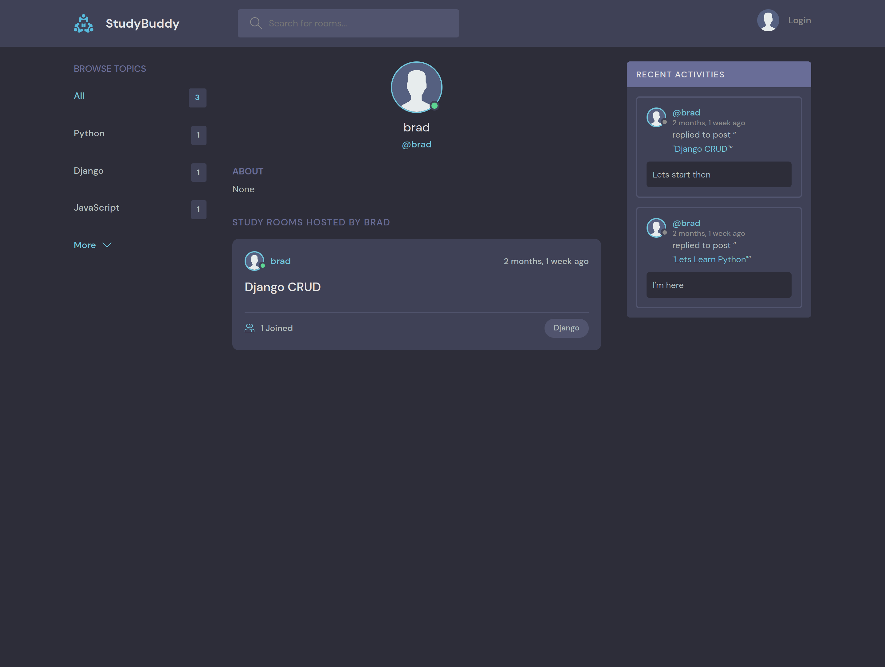
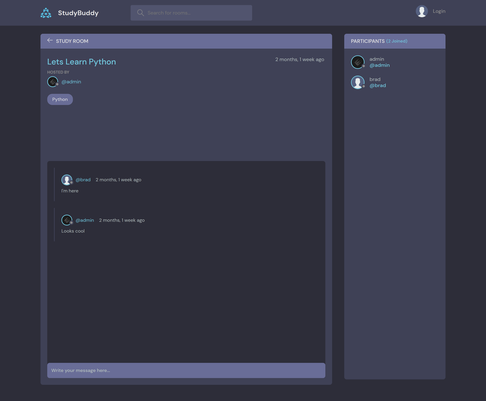
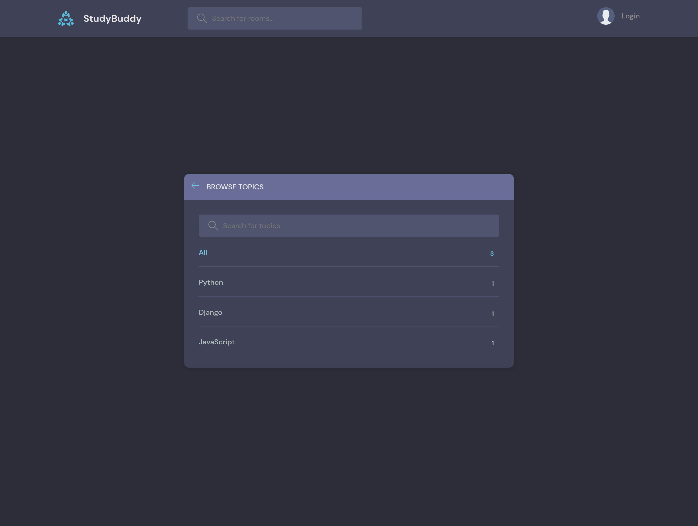

# StudyBuddy made With Django
Here is a simple Django project that I made to practice Django. It allows you to create rooms, add users in them and chat with other users.
## Features
* Users can create romms
* User can join rooms created by other users
* Users can chat in rooms
* Admin can delete rooms
* Admin can delete users
* Admin can delete messages
## Download & Setup Instructions

**These instructions are for Mac and Linux users. Instructions may differ for Windows users**

* 1 - Clone project:

      git clone https://github.com/bilal-zafarr/StudyBuddy.git
        
* 2 - Go to project directory:

      cd ./StudyBuddy

* 3 - Create virtual environment: 
        
      python3 -m venv venv
        
* 4 - Activate virtual environment: 
        
      source venv/bin/activate
        
* 5 - Install requirements: 

      python -m pip install -r requirements.txt
        
* 6 - Run django server:
      
      cd ./..
      python manage.py runserver

## Some Screens
#### Home Page

#### Login Page

#### Register Page

#### Profile Page

#### Room Page

#### Topics Page

